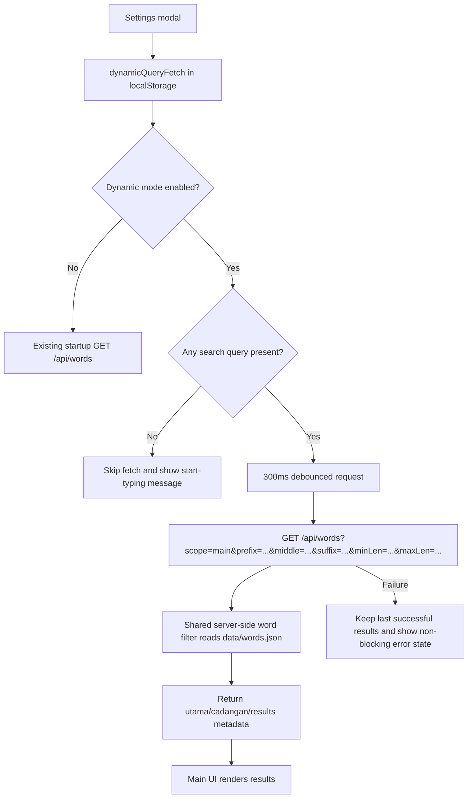

# Dynamic Query Word Fetching Roadmap

## I. Executive Summary
- **Goal**: Add a user-enabled dynamic mode that queries `data/words.json` server-side from the current search inputs instead of loading the entire dictionary upfront.
- **Success Metrics**:
  - Dynamic mode makes no full-dataset request when all search fields are empty and shows a prompt telling the user to start typing a search query.
  - Main search requests are debounced by a shared 300ms constant and fall back to the last successful result set when a dynamic request fails.
  - Admin filtering and pagination are served by the API instead of filtering the full dataset in the browser.

## II. Skill Matrix

| Component | Required Skill | Implementation Role |
|-----------|----------------|---------------------|
| Project planning | `planner` | Maintains this phased roadmap, dependency IDs, test procedures, and `WALKTHROUGH.md`. |
| Main settings UI | `frontend-design` | Adds the configuration toggle using the existing compact cyber-terminal visual language. |
| Fetch lifecycle | `native-data-fetching` | Defines debounced fetch, error handling, fallback behavior, and request cancellation. |
| Next.js API route | Next.js local docs from `node_modules/next/dist/docs/` | Verifies the installed `next@16.2.1` Pages Router API route conventions before implementation. |
| Search logic | Repository patterns | Extracts current client filtering into shared, typed server-side utilities without changing matching semantics. |

## III. Logic & Architecture

Implementation should preserve the current static mode for users who do not enable the new setting. Dynamic mode changes only read/search behavior on the main page; admin add/delete behavior remains backed by `POST` and `DELETE /api/words`.

## IV. Phased Roadmap

## Stage 1: Baseline and Contracts
> **Entry Condition**: Planning roadmap is approved and no implementation has started.
> **Exit Condition**: The repository has documented runtime constraints, typed search contracts, and a shared filter design that matches current UI behavior.

### Module 1.1: Runtime Verification

- [x] [P1.1.1] Install or Restore Dependencies: Ensure `node_modules/` exists using the repository lockfile so installed Next.js docs can be inspected.
      depends_on: none
      Verify: `test -d node_modules/next && test -d node_modules/next/dist || yarn install --frozen-lockfile`

- [x] [P1.1.2] Inspect Installed Next Docs: Read the relevant Pages Router and API route docs under `node_modules/next/dist/docs/` if present, and record any convention constraints in `WALKTHROUGH.md`.
      depends_on: P1.1.1
      Verify: `find node_modules/next/dist -path '*docs*' -type f | head` returns files or `WALKTHROUGH.md` records that the installed package does not ship docs.

### Module 1.2: Search Contract Design

- [x] [P1.2.1] Define Query Types and Constants: Add shared TypeScript types/constants for query fields, `DYNAMIC_FETCH_DEBOUNCE_MS = 300`, localStorage keys, page size, and response shapes.
      depends_on: P1.1.2
      Verify: TypeScript references include one source of truth for debounce duration, settings key, and query parameter names.

- [x] [P1.2.2] Extract Current Filter Semantics: Move the main page's current prefix, middle, suffix, min length, max length, utama, and cadangan rules into a shared pure helper.
      depends_on: P1.2.1
      Verify: The helper accepts a `string[]` and typed query object and returns deterministic `{ utama, cadangan }` results without reading browser state.

- [x] [P1.2.3] Add Admin Filter Helper: Add a shared helper for admin prefix/suffix filtering plus pagination metadata.
      depends_on: P1.2.2
      Verify: The helper returns `{ words, total, totalPages, currentPage }` and clamps invalid page values to valid boundaries.

### 🧪 Stage 1 Test Procedures

#### Test 1.1: Static Filter Parity
- **Type**: Unit
- **Preconditions**: Shared filter helper is implemented and test runner or equivalent TypeScript check is available.
- **Steps**:
  1. Run the helper with sample words `["kaca", "kata", "kara", "suka"]` and query `prefix="ka"`, `middle="a"`, `suffixTags=["a"]`.
  2. Compare returned `utama` and `cadangan` to the existing client-side algorithm's expected output.
- **Expected Result**: `utama` contains words matching all provided constraints and `cadangan` contains prefix matches that fail middle or suffix constraints.
- **Pass Command**: `yarn lint`
- **Fail Indicators**: Type errors, missing helper exports, or different grouping semantics from the current UI.

#### Test 1.2: Admin Pagination Boundaries
- **Type**: Unit
- **Preconditions**: Admin filter helper is implemented.
- **Steps**:
  1. Run the helper with 205 sample words, page size 100, and page `999`.
  2. Inspect the returned pagination metadata.
- **Expected Result**: `currentPage` is clamped to `3`, `totalPages` is `3`, and no exception is thrown.
- **Pass Command**: `yarn lint`
- **Fail Indicators**: Invalid page metadata, unhandled exception, or duplicated page-size literals.

## Stage 2: API Query Support
> **Entry Condition**: Stage 1 helpers and contracts are complete.
> **Exit Condition**: `/api/words` supports backward-compatible full reads plus filtered main/admin reads from `data/words.json`.

### Module 2.1: API Read Path

- [x] [P2.1.1] Add Query Parsing: Parse `scope`, `prefix`, `middle`, repeated or comma-separated `suffix`, `minLen`, `maxLen`, and `page` query params in `src/pages/api/words.ts`.
      depends_on: P1.2.3
      Verify: Invalid numeric values are ignored or normalized without throwing; empty strings are treated as absent filters.

- [x] [P2.1.2] Implement Main Dynamic Response: For `scope=main`, return filtered `{ utama, cadangan, totalLoaded, query }` from the shared helper.
      depends_on: P2.1.1
      Verify: `curl 'http://localhost:3000/api/words?scope=main&prefix=ka'` returns JSON with `utama` and `cadangan` arrays.

- [x] [P2.1.3] Implement Empty Dynamic Query Guard: For `scope=main` with no search inputs, return an empty result plus `requiresQuery: true` instead of the full dictionary.
      depends_on: P2.1.2
      Verify: `curl 'http://localhost:3000/api/words?scope=main'` returns `requiresQuery: true` and does not return the full `words` array.

- [x] [P2.1.4] Implement Admin Filtered Response: For `scope=admin`, return filtered paginated words and pagination metadata from the shared admin helper.
      depends_on: P2.1.3
      Verify: `curl 'http://localhost:3000/api/words?scope=admin&prefix=ka&page=1'` returns only page data plus total metadata.

- [x] [P2.1.5] Preserve Backward Compatibility: Keep `GET /api/words` with no `scope` returning the full string array for static main mode and existing callers.
      depends_on: P2.1.4
      Verify: `curl 'http://localhost:3000/api/words'` returns a JSON array, not the scoped response object.

### Module 2.2: API Write Path Safety

- [x] [P2.2.1] Keep POST and DELETE Response Compatibility: Ensure add/delete still return updated full arrays for current admin mutation reconciliation.
      depends_on: P2.1.5
      Verify: Existing `POST /api/words` and `DELETE /api/words` payloads continue to receive `words` arrays on success.

- [x] [P2.2.2] Centralize Data File Access: Reuse one data-file read/write helper so all GET/POST/DELETE paths share JSON parsing and file-existence behavior.
      depends_on: P2.2.1
      Verify: `src/pages/api/words.ts` has no duplicated `words.json` read logic across handlers.

### 🧪 Stage 2 Test Procedures

#### Test 2.1: Dynamic Main Query
- **Type**: Integration
- **Preconditions**: Dev server is running with `yarn dev`; `data/words.json` contains words beginning with `ka`.
- **Steps**:
  1. Run `curl 'http://localhost:3000/api/words?scope=main&prefix=ka'`.
  2. Inspect the JSON response.
- **Expected Result**: Response has `utama` and `cadangan` arrays; every returned word begins with `ka` unless it is excluded by additional filters.
- **Pass Command**: `curl 'http://localhost:3000/api/words?scope=main&prefix=ka'`
- **Fail Indicators**: Full raw array response, missing result keys, HTTP 500, or unfiltered words.

#### Test 2.2: Empty Dynamic Query Guard
- **Type**: Integration
- **Preconditions**: Dev server is running.
- **Steps**:
  1. Run `curl 'http://localhost:3000/api/words?scope=main'`.
  2. Inspect the JSON response.
- **Expected Result**: Response includes `requiresQuery: true`, `utama: []`, and `cadangan: []`; it does not include the entire dictionary.
- **Pass Command**: `curl 'http://localhost:3000/api/words?scope=main'`
- **Fail Indicators**: Full dictionary payload, missing `requiresQuery`, or HTTP 500.

#### Test 2.3: Backward-Compatible Full GET
- **Type**: Integration
- **Preconditions**: Dev server is running.
- **Steps**:
  1. Run `curl 'http://localhost:3000/api/words'`.
  2. Inspect the response shape.
- **Expected Result**: Response remains a JSON array of strings for static mode.
- **Pass Command**: `curl 'http://localhost:3000/api/words'`
- **Fail Indicators**: Response object instead of array, HTTP 500, or cache headers missing from the route.

## Stage 3: Main Search Dynamic Mode
> **Entry Condition**: Stage 2 API query support is complete.
> **Exit Condition**: The main page can switch between full local filtering and debounced server-side dynamic filtering from configuration UI.

### Module 3.1: Settings State

- [x] [P3.1.1] Add Dynamic Mode Setting: Extend `KamusSettings` and `DEFAULT_SETTINGS` with a disabled-by-default `dynamicQueryFetch` boolean.
      depends_on: P2.1.5
      Verify: Existing settings are merged safely from localStorage without losing older users' saved settings.

- [x] [P3.1.2] Add Settings Modal Toggle: Add a checkbox row for dynamic query fetching using the existing settings modal layout and copy style.
      depends_on: P3.1.1
      Verify: The toggle persists to `localStorage` under the existing settings object and rehydrates after reload.

### Module 3.2: Dynamic Fetch Lifecycle

- [x] [P3.2.1] Split Static and Dynamic Loading Paths: Keep the existing full `/api/words` startup fetch only when `dynamicQueryFetch` is false.
      depends_on: P3.1.2
      Verify: With dynamic mode enabled and empty search fields, the browser network panel shows no full `/api/words` request on page load.

- [x] [P3.2.2] Add 300ms Debounced Dynamic Search: Trigger `scope=main` fetches from prefix, middle, suffix tags, and visible length inputs after the shared debounce interval.
      depends_on: P3.2.1
      Verify: Typing three characters quickly produces one final search request after about 300ms of inactivity.

- [x] [P3.2.3] Add Request Cancellation and Stale Response Guard: Use `AbortController` or a request sequence guard so older dynamic responses cannot overwrite newer search results.
      depends_on: P3.2.2
      Verify: Rapidly changing prefix values does not render results for an older prefix after a later request completes.

- [x] [P3.2.4] Implement Last-Successful Fallback: If a dynamic request fails, keep rendering the last successful results and show a concise non-blocking error state.
      depends_on: P3.2.3
      Verify: Simulated HTTP 500 or network failure does not clear the previous successful results.

- [x] [P3.2.5] Add Empty Query Prompt: When dynamic mode is enabled and no search query exists, skip fetching and show a message that the user must start to type the search query.
      depends_on: P3.2.4
      Verify: Empty dynamic mode displays the prompt and `words.length` is not shown as if the full dictionary loaded.

### Module 3.3: Result Rendering

- [x] [P3.3.1] Normalize Result Source: Render `utama`, `cadangan`, and grouping from either client-side static results or API-provided dynamic results through one view model.
      depends_on: P3.2.5
      Verify: `HASIL UTAMA`, grouped results, used-word toggling, and context-menu actions behave the same in both modes.

- [x] [P3.3.2] Update Loading Labels: Replace the single `[ n ] Data Loaded` label with mode-aware labels for static loading, dynamic searching, dynamic results, fallback error, and empty-query prompt.
      depends_on: P3.3.1
      Verify: Each mode has a distinct observable message and no label claims full data was loaded in dynamic empty-query state.

### 🧪 Stage 3 Test Procedures

#### Test 3.1: Dynamic Mode Empty Query
- **Type**: Manual
- **Preconditions**: Dev server is running; browser localStorage has `kamus_settings.dynamicQueryFetch=true`; all search inputs are empty.
- **Steps**:
  1. Open `http://localhost:3000`.
  2. Open the browser network panel.
  3. Reload the page.
- **Expected Result**: No full `/api/words` request is made, no results are shown, and the UI says the user must start to type the search query.
- **Pass Command**: Manual browser verification at `http://localhost:3000`.
- **Fail Indicators**: Full dictionary request on load, stale result count, or no prompt.

#### Test 3.2: Debounced Dynamic Search
- **Type**: Manual
- **Preconditions**: Dynamic mode is enabled and the dev server is running.
- **Steps**:
  1. Type `k`, `ka`, `kat` quickly into the prefix input.
  2. Wait for 300ms after the final input.
  3. Inspect network requests and rendered results.
- **Expected Result**: Only the final query request is allowed to update the UI, and rendered words match the final `kat` query.
- **Pass Command**: Manual browser verification at `http://localhost:3000`.
- **Fail Indicators**: Multiple stale renders, old-prefix results shown, or no debounced request.

#### Test 3.3: Dynamic Failure Fallback
- **Type**: Manual
- **Preconditions**: Dynamic mode has already loaded one successful result set.
- **Steps**:
  1. Force the next dynamic request to fail by stopping the dev server or temporarily returning HTTP 500 from the API.
  2. Change the search query.
  3. Observe the result area.
- **Expected Result**: The previous successful results remain visible and a non-blocking error message indicates the latest dynamic search failed.
- **Pass Command**: Manual browser verification at `http://localhost:3000`.
- **Fail Indicators**: Previous results disappear, unhandled error appears, or UI becomes stuck in loading state.

## Stage 4: Admin Server-Side Filtering
> **Entry Condition**: Stage 2 API query support is complete.
> **Exit Condition**: Admin filtering and pagination query the server instead of filtering the full dataset in browser state.

### Module 4.1: Admin Initial Data

- [x] [P4.1.1] Replace Admin SSR Full File Read: Change admin initial props to request or compute page-1 admin-scoped data with pagination metadata.
      depends_on: P2.1.4
      Verify: Initial admin render receives only page data and total metadata, not the entire dictionary.

- [x] [P4.1.2] Keep Total Entries Display Accurate: Use API metadata for total filtered matches and total database count if needed by the header.
      depends_on: P4.1.1
      Verify: Header counts remain accurate when filters are empty and when prefix/suffix filters are active.

### Module 4.2: Admin Filter Fetching

- [x] [P4.2.1] Add Admin Query Fetch: Fetch `scope=admin` with prefix, suffix tags, and page whenever admin filters or pagination change.
      depends_on: P4.1.2
      Verify: Changing prefix updates the displayed page from the server response without client-side full-list filtering.

- [x] [P4.2.2] Debounce Admin Filter Fetches: Apply the same shared 300ms debounce to admin prefix/suffix filter requests.
      depends_on: P4.2.1
      Verify: Rapid admin filter typing does not fire one API request per keystroke.

- [x] [P4.2.3] Reconcile Add/Delete Mutations: After add or delete, refresh the current admin-scoped page or update state from returned API data without assuming a full in-memory list.
      depends_on: P4.2.2
      Verify: Adding or deleting a word updates counts and the current filtered page consistently.

- [x] [P4.2.4] Add Admin Error Fallback: If admin filtering fails, keep the last successful admin page and show an error message.
      depends_on: P4.2.3
      Verify: Simulated API failure does not clear the admin table.

### 🧪 Stage 4 Test Procedures

#### Test 4.1: Admin Server-Side Prefix Filter
- **Type**: Manual
- **Preconditions**: Dev server is running and `/admin` is open.
- **Steps**:
  1. Open the network panel.
  2. Type `ka` into the admin prefix filter.
  3. Wait 300ms.
  4. Inspect the API request and visible grid.
- **Expected Result**: Admin sends `GET /api/words?scope=admin&prefix=ka&page=1`; visible words all start with `ka`; pagination metadata matches filtered results.
- **Pass Command**: Manual browser verification at `http://localhost:3000/admin`.
- **Fail Indicators**: Client filters a full in-memory list, wrong page count, or stale rows remain.

#### Test 4.2: Admin Mutation Reconciliation
- **Type**: Manual
- **Preconditions**: Dev server is running and admin page is filtered to a prefix that includes the test word.
- **Steps**:
  1. Add a new unique word matching the current prefix.
  2. Confirm it appears or the current filtered page refreshes consistently.
  3. Delete the same word.
  4. Confirm counts and rows update.
- **Expected Result**: Add/delete actions keep filtered page data and counts consistent without requiring a full page reload.
- **Pass Command**: Manual browser verification at `http://localhost:3000/admin`.
- **Fail Indicators**: Added word missing from relevant filtered result, deleted word remains visible, or counts are stale.

## Stage 5: Final Verification and Cleanup
> **Entry Condition**: Stages 1 through 4 are complete.
> **Exit Condition**: Type checks, lint/build, and manual workflows pass with documented results in `WALKTHROUGH.md`.

### Module 5.1: Automated Checks

- [x] [P5.1.1] Run Lint: Execute the repository lint command and fix introduced issues.
      depends_on: P3.3.2, P4.2.4
      Verify: `yarn lint`

- [x] [P5.1.2] Run Production Build: Execute the Next.js production build and fix introduced issues.
      depends_on: P5.1.1
      Verify: `yarn build`

### Module 5.2: Manual Acceptance

- [ ] [P5.2.1] Verify Static Mode Regression: Disable dynamic mode and confirm the original full-load search workflow still works.
      depends_on: P5.1.2
      Verify: Static mode loads `[ n ]` data and client-side search, grouping, archive, and KBBI context menu still work.

- [ ] [P5.2.2] Verify Dynamic Mode Acceptance: Enable dynamic mode and confirm empty-query prompt, debounced server queries, fallback-on-failure, and result rendering.
      depends_on: P5.2.1
      Verify: Manual Stage 3 tests pass in browser.

- [ ] [P5.2.3] Verify Admin Acceptance: Confirm admin filter, pagination, add, and delete workflows operate through server-side filtered data.
      depends_on: P5.2.2
      Verify: Manual Stage 4 tests pass in browser.

- [x] [P5.2.4] Update Walkthrough Completion State: Record completed tasks, commands run, changed files, and residual caveats in `WALKTHROUGH.md`.
      depends_on: P5.2.3
      Verify: `WALKTHROUGH.md` lists final verification commands and next allowed task as none.

### 🧪 Stage 5 Test Procedures

#### Test 5.1: Automated Quality Gate
- **Type**: Integration
- **Preconditions**: All implementation tasks are complete and dependencies are installed.
- **Steps**:
  1. Run `yarn lint`.
  2. Run `yarn build`.
- **Expected Result**: Both commands exit with code 0.
- **Pass Command**: `yarn lint && yarn build`
- **Fail Indicators**: ESLint errors, TypeScript errors, failed Next build, or missing dependency errors.

#### Test 5.2: End-to-End User Workflow
- **Type**: E2E Manual
- **Preconditions**: Dev server is running.
- **Steps**:
  1. Open `http://localhost:3000`.
  2. Enable dynamic query fetching in settings.
  3. Clear all search fields and confirm the start-typing prompt.
  4. Type a prefix and confirm server-filtered results after debounce.
  5. Mark one result as used and confirm archive behavior.
  6. Open `http://localhost:3000/admin`.
  7. Filter by the same prefix and confirm server-side paginated results.
- **Expected Result**: Main and admin workflows pass without full dynamic empty-query loading, stale result overwrites, or broken used-word interactions.
- **Pass Command**: Manual browser verification at `http://localhost:3000` and `http://localhost:3000/admin`.
- **Fail Indicators**: Empty dynamic mode fetches all data, admin filters client-side from a full array, debounce is absent, or previous successful results are cleared after request failure.

## V. Final Verification Checklist

- [ ] `node_modules/next/dist/docs/` availability is checked after dependency installation, and any relevant `next@16.2.1` API-route guidance is followed.
- [ ] Dynamic mode is disabled by default and persisted through the existing settings localStorage object.
- [ ] Dynamic mode skips all full data loading when no search query exists.
- [ ] Empty dynamic mode shows a message that the user must start to type the search query.
- [ ] Dynamic main search uses a shared 300ms debounce constant.
- [ ] Failed dynamic main searches keep the last successful result set visible.
- [ ] `GET /api/words` remains backward compatible for static mode.
- [ ] `GET /api/words?scope=main` returns scoped result objects and guards empty queries.
- [ ] `GET /api/words?scope=admin` returns filtered page data and pagination metadata.
- [ ] Admin filtering and pagination no longer require the browser to hold the full dictionary.
- [ ] `POST` and `DELETE /api/words` still support existing add/delete workflows.
- [ ] `yarn lint` passes.
- [ ] `yarn build` passes.
